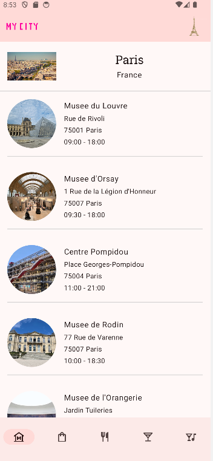
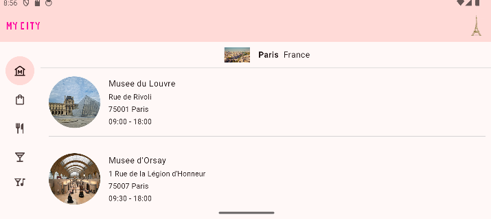
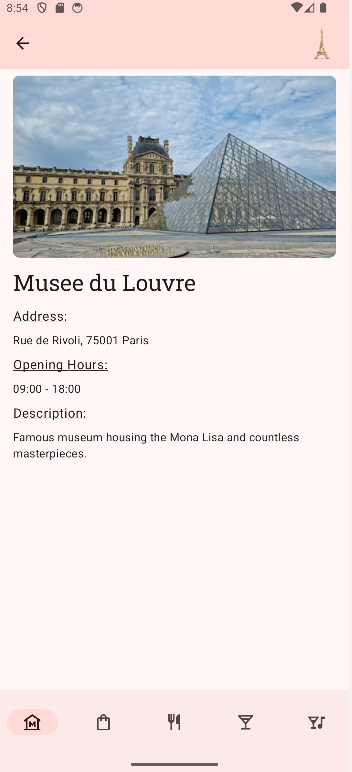
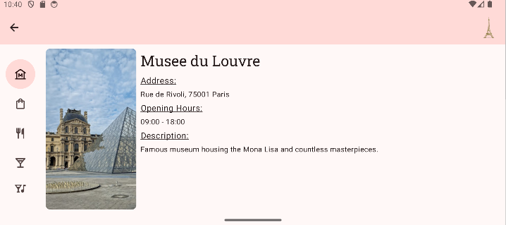
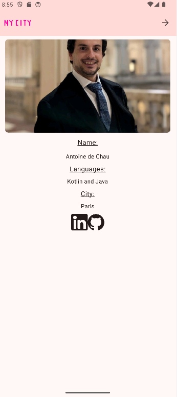
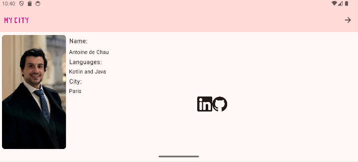

# 🏙️ **MyCity**
**MyCity** is a modern Android application that allows users to explore curated lists of recommendations for various activities and places to visit in the city of their choice. It is built with Jetpack Compose and follows Android development best practices, including the MVVM architecture.

## 📋 **Features**
   - 🌍 **City Selection**:
      - ✅ **DONE** Choose between multiple cities and get recommendations tailored to the selected city.
   - 🌟 **Personalized Recommendations**:
      - ✅ **DONE** Browse different categories of activities, such as restaurants, museums, parks, and more.
      - ✅ **DONE**  Each category provides a list of places or activities with images and specific details.
   - 🎨 **Modern and Fluid Interface**:
      - ✅ **DONE** **TopBar Implementation**:
         - Displays the application logo on the left.
         - Shows a city image placeholder on the right.
         - Displays some back buttons to return to the home page.
         - Adapts padding to system insets (status bar and navigation buttons).
      - 🟢 **IN PROGRESS** **BottomNar/NavigationRail/NavigationDrawer Implementation**:
         - Displays the categories.
         - Shows a category icon you can select for see places.
         - **BottomBar** for smartphone in portrait.
         - **NavigationRail** for smartphone in landscape.
         - **Navigation Drawer** for tablet.
      - 🟢 **IN PROGRESS** **Developper page**:
         - Display developper informations.
      - Built with Jetpack Compose for a declarative user interface.
      - Integrated with Material 3 for an accessible and contemporary design.
      - Supports light and dark themes.
      - 🟢 **IN PROGRESS** Adaptive layouts for smartphones and tablets.
   - 🔄 **Smooth Navigation**:
      - ✅ **DONE** Navigate seamlessly between different screens using Jetpack Navigation.                   

## 🛠️ **Tech Stack**
   - **Kotlin**: Modern, concise language for Android development.
   - **Jetpack Compose**: Declarative UI toolkit for Android.
   - **Material 3**: Modern, accessible user interface.
   - **StateFlow**: Reactive state management for real-time updates.
   - **ViewModel**: MVVM architecture to separate business logic from user interface.
   - **Jetpack Navigation**: Manages navigation between screens.
   - **WindowSizeClass**: Adaptative Ui.
   - **WindowInsets**: Smart handling of system UI insets for immersive and adaptive layouts.

## 📦 **Project Structure**

**Packages**:

1. **datasource**: Provides static and local data models:
   - **LocalCitiesDataProvider**: Contains the list of available cities.
   - **LocalNavigationCategoriesContentDataProvider**: Provides navigation content for categories.
   - **LocalPlacesLondonDataProvider**: Provides details about places in London.
   - **LocalPlacesNewYorkDataProvider**: Provides details about places in New York.
   - **LocalPlacesParisDataProvider**: Provides details about places in Paris.
   - **LocalPlacesRomeDataProvider**: Provides details about places in Rome.

2. **model**: Defines data models for cities, categories, and places:
   - **City**: Represents a city with its details such as name, image, and location.
   - **Category**: Represents categories of places (e.g., museums, restaurants).
   - **Place**: Represents a specific place with details like description, address, and category.
   - **MyCityUiState**: Manages the UI state, including selected city, category, and places.

3. **ui**: Implements the user interface using Jetpack Compose:

   - **ui.theme**:
      - **Color.kt**: Defines the color palette for the application.
      - **Theme.kt**: Manages light and dark themes using Material 3.
      - **Type.kt**: Specifies typography styles.

   - **ui.utils**:
      - **MyCityContentType**: Enum for handling adaptive UI content.
      - **MyCityNavigationType**: Enum for handling navigation types (BottomNav, Rail, Drawer).
      - **MyCityScreenEnum**: Enum for managing screen routing.
      - **WindowInsetsUtils.kt**: Utility for calculating system padding and insets.

   - **ui.components**:
      - **MyCityApp.kt**: Main entry point of the app managing the scaffold and navigation.
      - **MyCityAppBar.kt**: Composable for the bar with dynamic content (e.g., logo, back button, or menu).
      - **MyCityAppHomeScreen.kt**: Displays navigation drawer and detail pages.
      - **MyCityAppHomeContent.kt**: Displays the list content.
      - **MyCityListAndDetailsContent.kt**: Handles list and details page displaying.
      - **MyCityDevScreen.kt**: Provides a page for developer information.

   - **MyCityViewModel**: Manages the state of the application using StateFlow, Updates the UI state, including current city, category, and selected place.

4. **MainActivity**: Serves as the app's entry point:
   - Initializes and launches the main content using Jetpack Compose.
   - Handles window size classes and adaptive padding for landscape and portrait orientations.
   - Enables the `enableEdgeToEdge()` option for an immersive experience, where the Android system bars (status bar and navigation bar) are visually integrated into the interface.
   - Implements the calculation of safety margins (`calculateLandscapeSafePadding()`) for better management in landscape mode.
   
## 🚀 **How to Use**
1. **Launch the App**:
   - Open the app on a Android device or emulator.
2. **Choose city**:
   - Click on the city icon and use the **MenuDrawer** in the **TopBar** to select the city.
3. **Choose places category**:
   - Use the **BottomBar** to select the category of places (or the **NavigationRail** if you are in landscape).
4. **Navigate the places list:**:
   - Browse the different places in the list.
5. **View place details**:
   - Tap on a place to see its details.
6. **Navigate between screens**:
   - Use the left **ArrowButton** on the **TopBar** to return to the list.
7. **Go to developper page**:
   - Use the **AppLogoIcon** to go to the developper page.
8. **Navigate between screens**:
   - Use the right **ArrowButton** on the **TopBar** to return to the list.

   
## 📸 **Screenshots**
- **Main screen**:

   
   

- **Details screen**:

   
   

- **Dev screen**:

   
   

## 🤝 **Contributions**
Contributions are welcome! Feel free to fork the repository and submit a pull request for new features or bug fixes.✅